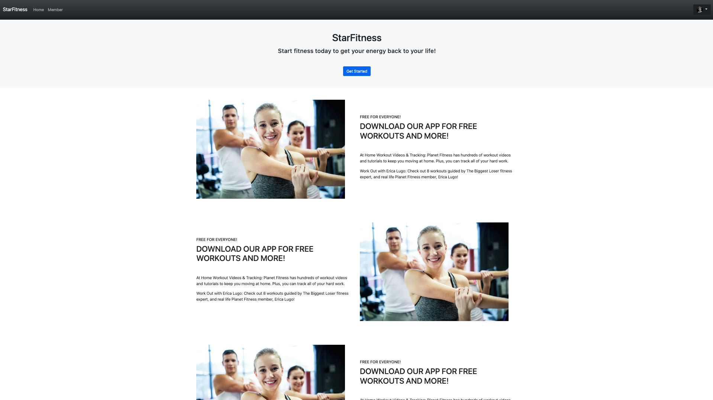
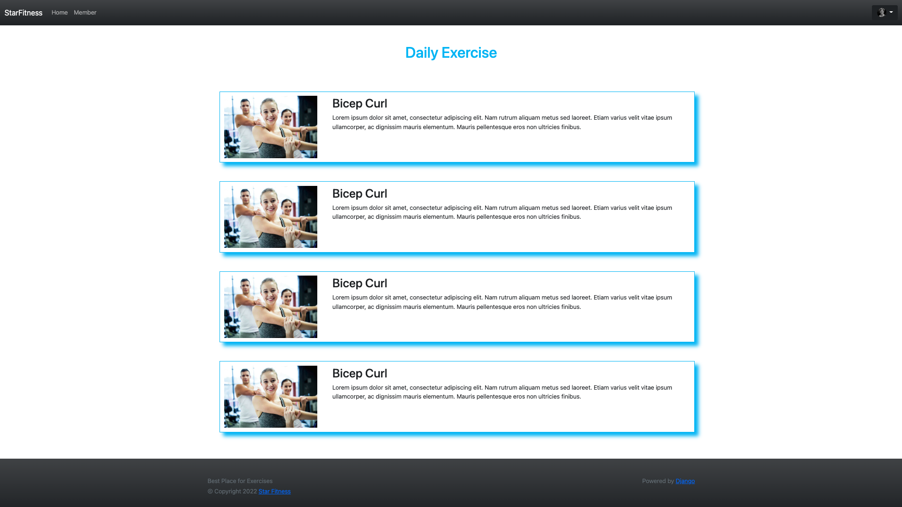
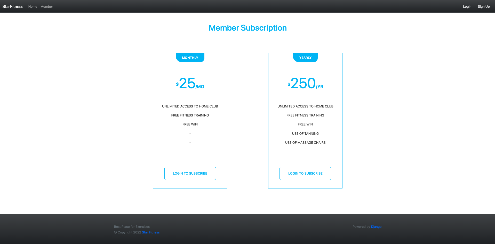
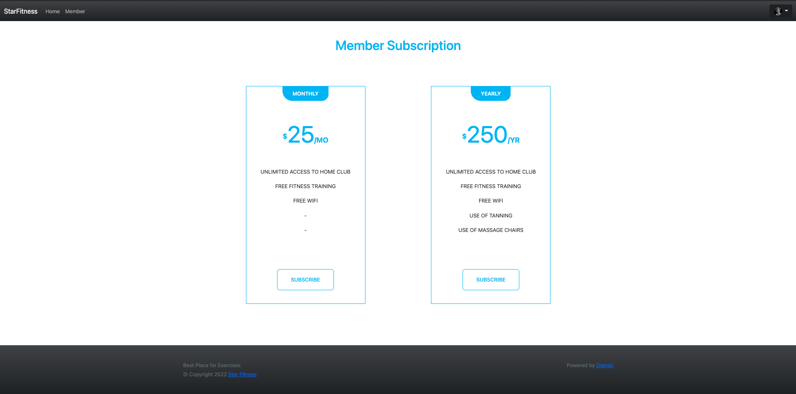
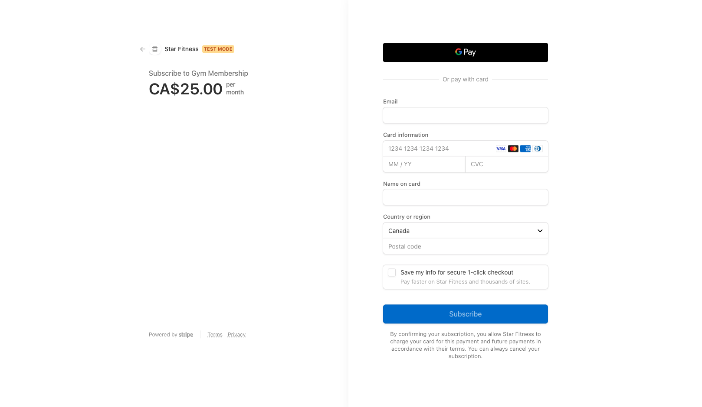
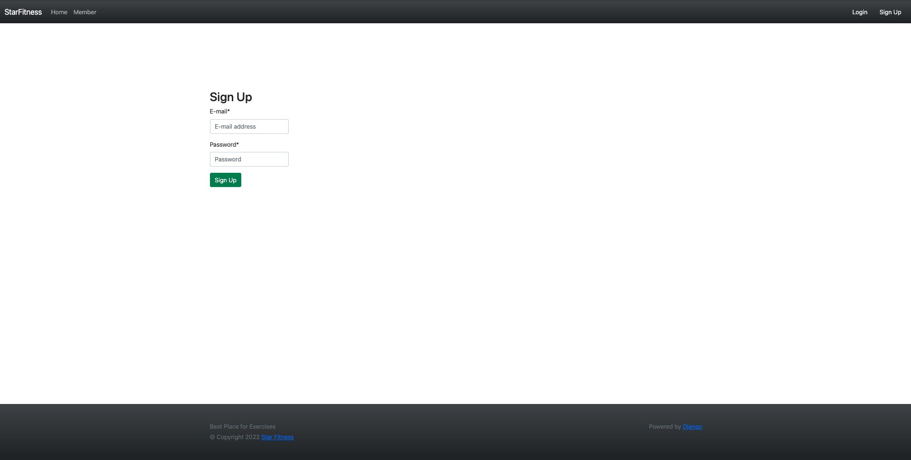
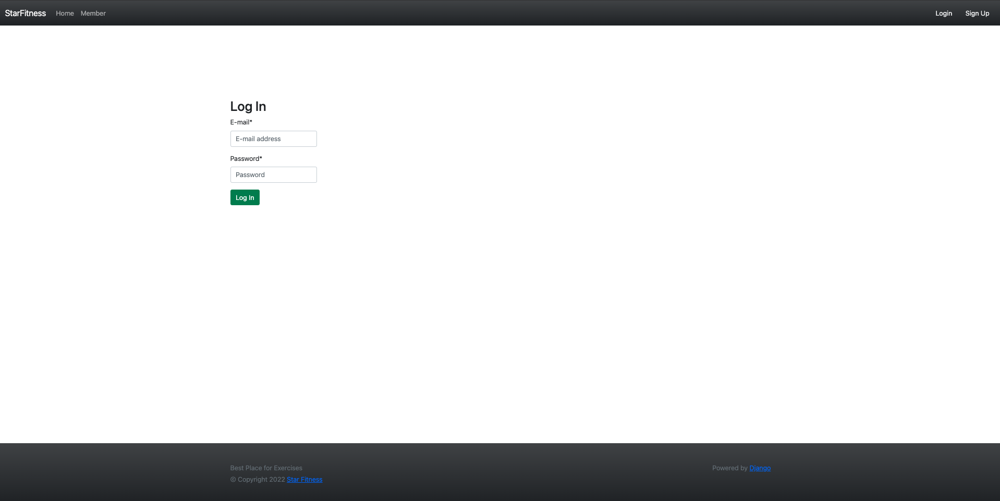
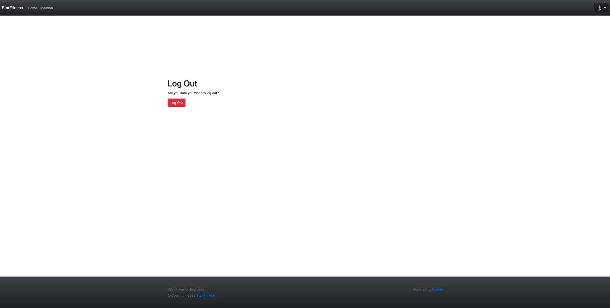

# Star-Fitness

## What is Used
- Python 3
- Django 
- Django-allauth
- Stripe

## Project Photos

### Landing Page

### Home Page

### Logged in Subscribed user

### Not logged in

### Logged in but not subscribed

### Stripe Payment

### Signup Page

### Login Page

### Logout Page

## how to start

## Stripe Integration

Stripe integration was based on [this tutorial](https://testdriven.io/blog/django-stripe-subscriptions/)